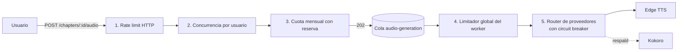

# Lectio — Decisión de Proveedor TTS y Control de Consumo

*Registro de decisión (ADR). Fecha: septiembre 2026.*

---

## 1. Contexto

La documentación del MVP (`lectio-documentacion.md` §9) eligió Microsoft Edge TTS por costo cero. Quedaban dos dudas abiertas:

1. ¿Puede Edge TTS usarse en producción, o solo en un proyecto de portafolio?
2. Si hay que cambiar, ¿es Kokoro-82M (open source) demasiado caro de operar?

Además, independiente del proveedor, hace falta evitar que un solo usuario sature el servicio de TTS o dispare el gasto (ver sección 6).

**Supuesto de cálculo:** un libro promedio tiene ~500.000 caracteres (≈ 9 horas de audio a ~900 caracteres por minuto).

---

## 2. Edge TTS: riesgos en producción

### 2.1 Términos de uso: zona gris con inclinación a incumplimiento

- No existe documento de Microsoft que mencione explícitamente el endpoint de "Leer en voz alta".
- El Microsoft Services Agreement (vigente desde 30-09-2025) prohíbe eludir restricciones de acceso a los servicios y emularlos o aplicarles ingeniería inversa. Las librerías no oficiales emulan al cliente Edge y reproducen su token de autenticación (`Sec-MS-GEC`). — https://www.microsoft.com/en-us/servicesagreement
- En Microsoft Q&A (junio 2026), un moderador indicó que no hay documentación pública sobre uso comercial y recomendó consultar a Microsoft Legal. — https://learn.microsoft.com/en-au/answers/questions/5925556/commercial-use-of-edge-read-aloud-voices-via-edge
- Consenso de la comunidad: uso personal sí; uso comercial vía Azure. — https://learn.microsoft.com/en-us/answers/questions/2088770/are-opensource-edge-tts-free-for-commercial-use

### 2.2 Estabilidad

| Incidente | Fuente |
|---|---|
| Oct-2024: Microsoft exige el token `Sec-MS-GEC`; todas las peticiones fallan con 403 hasta que se parchea la librería. | https://github.com/rany2/edge-tts/issues/290 |
| La versión del token rota con cada release de Edge; algunos ports mantienen un CI diario solo para detectar el 403. | https://github.com/Artanniel/quarkus-edge-tts/issues/8 |
| 403 recurrentes, uno de ene-2026 cerrado sin solución. | https://github.com/rany2/edge-tts/issues/458 |
| 503 en el handshake (jul-2026), sin respuesta del mantenedor. | https://github.com/rany2/edge-tts/issues/482 |
| Bloqueo de IPs de datacenter/cloud. | **No verificado** (sin evidencia, pero no descartado). |

### 2.3 Límites prácticos

- La librería de referencia divide el texto en fragmentos de **4.096 bytes** por petición. — https://github.com/rany2/edge-tts/blob/master/src/edge_tts/communicate.py
- Textos largos (~39.000 caracteres) generan audio truncado en puntos aleatorios. — https://github.com/rany2/edge-tts/issues/190
- No hay límites publicados de concurrencia o frecuencia (**no verificado**). Se asume que hay que limitarse (ver §6.5).

### 2.4 Lo que sí ofrece

- Voces neuronales en español de buena calidad (las mismas de Azure).
- Eventos `WordBoundary` y `SentenceBoundary` para alineación. Ojo: desde edge-tts 7.2.3 y en `edge-tts-universal` el valor por defecto es `SentenceBoundary`; `WordBoundary` hay que pedirlo explícitamente. — https://www.npmjs.com/package/edge-tts-universal

---

## 3. Alternativas evaluadas

### 3.1 Costo por libro

| Opción | $/libro | $/100 libros/mes | Notas |
|---|---|---|---|
| Edge TTS | $0 | $0 | Riesgo legal y de caídas (§2). |
| **Kokoro-82M vía API (DeepInfra)** | **~$0,31** | **~$31** | $0,62 / 1M caracteres; ofrece timestamps. — https://deepinfra.com/hexgrad/Kokoro-82M |
| Kokoro en GPU serverless (Modal T4 / RunPod L4) | ~$0,10–0,30 * | ~$10–30 * | T4 a ~36x tiempo real ≈ 15 min de GPU por libro. Modal regala $30/mes de crédito. — https://modal.com/pricing · https://www.runpod.io/pricing |
| Kokoro self-hosted, VPS Hetzner 8 vCPU (€15,99/mes) | ~€0,16 * | ~€16 * | Unos 100 libros/mes como máximo; ~7 h por libro en CPU. — https://docs.hetzner.com/general/infrastructure-and-availability/price-adjustment/ |
| Kokoro self-hosted en Railway (CPU) | ~$1,70 * | ~$170 * | Railway cobra caro el cómputo sostenido. — https://docs.railway.com/pricing/plans |
| Google Cloud TTS Standard/WaveNet | ~$2,00 | ~$200 | $4 / 1M (**no verificado en fuente oficial**). |
| Azure AI Speech Neural (mismas voces que Edge) | $7,50 | ~$750 | $15 / 1M; capa gratuita F0 de 0,5M caracteres/mes (≈ 1 libro). — https://azure.microsoft.com/en-us/pricing/details/speech/ |
| OpenAI tts-1 | $7,50 | ~$750 | $15 / 1M. — https://developers.openai.com/api/docs/models/tts-1 |

\* Estimación propia a partir de benchmarks publicados (Kokoro-FastAPI: https://github.com/remsky/Kokoro-FastAPI; kokoro-onnx en CPU: https://gist.github.com/efemaer/23d9a3b949b751dde315192b4dcf0653). Consistente con el dato de Audiblez reportado por NotebookLM (~160.000 caracteres en 5 min en una T4).

### 3.2 Precio de referencia del mercado

ElevenReader Ultra cuesta **~$8,25–11/mes con conversión ilimitada** de archivos propios y voces de primer nivel (fuente: NotebookLM, sin verificar). Ese es el precio contra el que compite Lectio si algún día cobra.

Consecuencia directa: **Azure y OpenAI quedan descartados como proveedores de producción comercial.** A ~$7,50 por libro, un usuario que escuche un libro y medio al mes ya cuesta más de lo que pagaría en ElevenReader. Solo un modelo abierto (~$0,30 por libro) deja margen.

### 3.3 Licencias de modelos abiertos

| Modelo | Licencia | Uso comercial |
|---|---|---|
| **Kokoro-82M** | Apache 2.0 | Sí, sin regalías. |
| **Chatterbox** (Resemble AI) | MIT | Sí. |
| XTTS v2 (Coqui) | CPML | **No.** Coqui cerró en 2024: no hay forma de comprar licencia comercial. Descartado. |
| Piper | GPL-3.0 (código actual); licencia distinta por voz | Posible, con cuidado; calidad inferior. |

### 3.4 El punto débil de Kokoro: el español

- Solo 3 voces en español (`ef_dora`, `em_alex`, `em_santa`), sin nota de calidad; el propio model card advierte que el soporte fuera del inglés puede ser escaso. — https://huggingface.co/hexgrad/Kokoro-82M/blob/main/VOICES.md
- Problemas reportados con números y siglas, y un límite de ~510 tokens por fragmento. — https://github.com/Topping1/Kokoro-TTS-spanish
- Las marcas de tiempo por palabra solo son fiables en inglés. — https://ryanwelch.co.uk/blog/kokoro-word-timestamps/

**Impacto en Lectio: bajo.** El pipeline (`lectio-pipeline-limpieza.md` §4) alinea audio y texto **por oración**, no por palabra, y tiene una estrategia de respaldo para proveedores sin marcas de tiempo. Lo que sí hay que validar es la **calidad percibida** de la voz en español.

**Chatterbox** es el candidato alternativo por esa razón. Existe una variante multilingüe que incluiría español (**no verificado**: confirmar idiomas y calidad antes de decidir).

---

## 4. Decisión

| Fase | Proveedor | Motivo |
|---|---|---|
| **MVP / portafolio** | **Edge TTS** (adaptador principal) | Costo cero, buenas voces en español, marcas de palabra. Riesgo aceptable para un proyecto sin usuarios de pago. |
| **MVP / portafolio** | **Kokoro vía DeepInfra** (segundo adaptador, respaldo) | Demuestra que el puerto `TtsProvider` realmente permite cambiar de proveedor, y cubre las caídas de Edge (§6.6). Costo marginal (~$0,31 por libro). |
| **Producción comercial** | **Kokoro o Chatterbox**, según una prueba a oído | Único rango de costo compatible con el precio de mercado. |
| Descartados | Azure, OpenAI, Google (producción); XTTS v2 (licencia) | Costo por libro incompatible con el precio de referencia / licencia no comercial. |

**Validación pendiente antes de pasar a producción:** narrar 2–3 capítulos en español (un clásico del corpus de dominio público) con Kokoro y con Chatterbox, y compararlos a oído con Edge.

---

## 5. Consecuencias técnicas

- El puerto `TtsProvider` queda como lo define el pipeline (§4, etapa 10): recibe fragmentos, expone `maxChunkChars` y devuelve `boundaries` opcionales.
- Valores iniciales de `maxChunkChars`: Edge ~3.000 caracteres (margen bajo los 4.096 bytes, considerando acentos en UTF-8 y el envoltorio SSML); Kokoro ~1.500 caracteres (por el límite de ~510 tokens).
- Adaptador Edge: solicitar `WordBoundary` explícitamente.
- **Voces: cuatro perfiles de Lectio (§7), por defecto `gonzalo`** (`es-CO-GonzaloNeural` con prosodia propia para narración y diálogo). En inglés, `en-US-AndrewNeural` sin perfil. Se cambia con `--voice`; `lectio voices es` lista perfiles y voces.
- **Librería: `msedge-tts` (MIT).** Se descartó `edge-tts-universal` por su licencia AGPL-3.0, que obligaría a publicar el código de un worker comercial. El token `Sec-MS-GEC` va con una versión fija en la librería: si Edge empieza a responder 403, lo primero es actualizarla.
- El stream de metadatos de Edge no siempre emite su fin: el adaptador termina con el audio y usa las marcas recibidas hasta ese momento.
- Documentar en el README el riesgo de términos de uso de Edge TTS: es una decisión consciente, no un descuido.

---

## 6. Control de consumo y protección del proveedor

### 6.1 El problema

Un usuario no debería poder, con un clic (o con un script), disparar la síntesis de un libro entero: eso satura al proveedor, dispara el gasto (con Kokoro/DeepInfra) o provoca un bloqueo (con Edge). Se busca que el consumo sea **gradual, acotado por usuario y absorbible por el sistema**.

### 6.2 ¿Hace falta un API Gateway?

**No para el MVP.** Un gateway (Kong, AWS API Gateway, etc.) limita *peticiones por segundo*, pero no sabe que un capítulo cuesta 40.000 caracteres y otro 3.000, ni cuánto le queda a un usuario este mes. Esa es lógica de negocio, y vive en el caso de uso `RequestAudioGenerationUseCase`. Un gateway añadiría otra pieza de infraestructura sin resolver el problema de fondo.

Si en el futuro hay varios servicios, un gateway o un proxy en el borde (ej. Cloudflare) puede sumarse para limitar tráfico abusivo genérico. Complementa las capas de abajo, no las reemplaza.

### 6.3 Qué cuesta y qué no

| Operación | ¿Cuesta? | Tratamiento |
|---|---|---|
| Parsear y limpiar el libro completo (etapas 1–9 del pipeline) | **No.** Es cómputo local, segundos por libro. | Se hace completo al subir. Así se conoce `character_count` de cada capítulo *antes* de generar audio, lo que permite calcular la cuota con exactitud. |
| Generar audio (etapas 10–11) | **Sí** (dinero o riesgo de bloqueo). | Solo por capítulo y bajo demanda, con las capas de §6.4. |

### 6.4 Capas de control

**Capa 0 — Granularidad por capítulo (por diseño de API).** No existe un endpoint para "generar el libro entero". La unidad mínima y máxima de trabajo es un capítulo.

**Capa 1 — Rate limit HTTP.** `@nestjs/throttler` sobre `POST /chapters/:id/audio` (ej. 10 solicitudes por minuto por usuario). Protección genérica contra scripts y clics repetidos.

**Capa 2 — Concurrencia por usuario.** Un usuario puede tener como máximo **N capítulos en cola o en proceso a la vez** (ej. N = 2: el que escucha y el siguiente). Si ya tiene N, se responde `429` con código `AUDIO_CONCURRENCY_LIMIT`. Esto impide encolar 40 capítulos seguidos aunque tenga cuota de sobra: el consumo avanza al ritmo en que escucha.

**Capa 3 — Cuota mensual de caracteres con reserva.**
- Cada usuario tiene una cuota mensual (ej. 300.000 caracteres ≈ 60 % de un libro promedio; valor a calibrar).
- Al solicitar, se calcula: `consumido del mes + reservado + character_count del capítulo ≤ cuota`. Si no alcanza → `429` con código `TTS_QUOTA_EXCEEDED` y los caracteres restantes.
- **Reserva:** el capítulo encolado "reserva" sus caracteres; al completarse, la reserva se convierte en consumo (`TtsUsageLog`); si falla definitivamente, se libera. Sin reserva, dos solicitudes simultáneas podrían pasar el chequeo y superar la cuota.
- La reserva no necesita tabla propia: es la suma de `character_count` de los capítulos con `AudioSegment` en `pending`/`processing` solicitados por ese usuario. La verificación y la creación del `AudioSegment` van en una misma transacción.

**Capa 4 — Limitador global del worker.** BullMQ controla cuántas síntesis corren a la vez **en todo el sistema**, independiente de cuántos usuarios haya:
- `concurrency` del worker (ej. 2–4 para Edge).
- `limiter: { max, duration }` de BullMQ (ej. máx. 30 fragmentos por minuto).

La cola absorbe los picos: si 50 usuarios piden audio a la vez, esperan un poco más, pero el proveedor nunca recibe más carga de la configurada. Esta es la capa que evita que "la IA se sature".

**Capa 5 — Router de proveedores con circuit breaker.** Un `TtsProviderRouter` implementa el mismo puerto `TtsProvider` y delega:
- Si Edge falla N veces seguidas con 403/503, el circuito se abre y durante un tiempo las solicitudes van a Kokoro (o la cola se pausa, según configuración).
- Pasado ese tiempo, prueba Edge de nuevo con una solicitud (estado half-open).

Es el mismo patrón de puertos y adaptadores ya definido: el dominio no sabe cuántos proveedores hay detrás.

### 6.5 Experiencia de usuario: prefetch del siguiente capítulo

Generar por capítulo no debe significar esperar entre capítulos. Cuando la reproducción del capítulo N pasa el ~70 %, el cliente solicita automáticamente el N+1. Ese capítulo cuenta para la cuota y para el límite de concurrencia (por eso N = 2 en la capa 2). Si la cuota no alcanza, el reproductor avisa antes de que termine el capítulo actual, no después.

### 6.6 Ahorro adicional

- **Libros públicos:** su audio se genera una sola vez, por el proceso interno de carga, y no consume la cuota de nadie. `POST /chapters/:id/audio` sobre un libro público responde `403`.
- **Solo lo narrable:** la cuota se mide con los caracteres de `narration` (el texto limpio que realmente se envía), no con el texto bruto del EPUB. La limpieza del pipeline también reduce costos.
- **Deduplicación entre usuarios (v1.1, a evaluar):** si dos usuarios suben el mismo EPUB (mismo hash), el audio podría reutilizarse. Requiere revisar implicancias de derechos antes de implementarlo, así que queda fuera del MVP.

### 6.7 Cambios en otros documentos

| Documento | Cambio |
|---|---|
| Modelo de datos | `AudioSegment` + `requested_by` (FK → User, nullable para libros públicos). |
| API | `POST /chapters/:id/audio` puede responder `429` con `code: AUDIO_CONCURRENCY_LIMIT` o `TTS_QUOTA_EXCEEDED`; `403` sobre libros públicos. `GET /users/me/usage` devuelve `{ periodStart, quota, consumed, reserved, remaining, totalCharactersProcessed }`. |
| Requisitos | RF-22, RF-23, RF-24 y RNF-07 en `lectio-documentacion.md`. |

---

## 7. Voces, prosodia y pausas

### 7.1 El problema

Escuchando capítulos completos, la voz sonaba "a máquina": las preguntas no sonaban a pregunta, narración y diálogos sonaban iguales, y las pausas tras un punto y aparte, "?" o "!" se sentían largas.

### 7.2 Qué permite Edge (probado)

- Un solo `<prosody>` por solicitud. Varios `<prosody>`, el atributo `contour` (curva de entonación) o `mstts:express-as` (estilos) hacen que Edge cierre la conexión sin audio. Los estilos existen en Azure, que es de pago.
- Las voces *Multilingual* (Andrew, Emma, Brian) aceptan acento de México o Colombia, pero leen el español con un dejo inglés muy notorio en las preguntas ("¿Piedras? ¿Y para qué…?"). Se descartaron.
- Las voces regionales sí entonan bien las preguntas; su debilidad era la falta de contraste y el ritmo.

### 7.3 Solución: una solicitud por unidad de voz

1. **Diálogo y narración** (pipeline, `narration/dialogue.ts`): se detectan la raya de diálogo (español, portugués, catalán, gallego) y el texto entre comillas que termina en puntuación o es largo. Cada oración con diálogo lleva sus tramos (`Sentence.voices`); los golden files los muestran como `D:` y `N:`.
2. **Unidades** (pipeline, `audio/units.ts`): una solicitud por oración, o por tramo dentro de ella, con el tipo de pausa que la sigue.
3. **Prosodia por tramo** (adaptador): cada perfil define velocidad y tono de narración y de diálogo.
4. **Pausas propias** (CLI, `tts/mp3.ts`): se recorta el silencio que Edge pone al inicio y al final de cada unidad (con las marcas de palabra, en tramas MP3 de 24 ms) y se inserta silencio digital: 140 ms dentro de la oración, 300 ms entre oraciones, 480 ms entre párrafos. Un pasaje de prueba pasó de 22,1 s a 18,2 s con la misma habla.
5. **Alineación exacta:** cada unidad es una solicitud, así que los tiempos de cada oración se conocen sin estimar.

Costo: los mismos caracteres, muchas más solicitudes (un capítulo de Marianela: 5 → 131). Con la conexión reutilizada y dos en paralelo, un capítulo de 10 min se genera en ~40 s. La cuota (§6) se mide en caracteres, así que no cambia.

### 7.4 Perfiles elegidos (a oído, 2026-09-25)

| Perfil | Voz | Narración (velocidad / tono) | Diálogo (velocidad / tono) |
|---|---|---|---|
| `gonzalo` (por defecto) | es-CO-GonzaloNeural | +6 % / −7 % | +0 % / +10 % |
| `jorge` | es-MX-JorgeNeural | +26 % / −7 % | +20 % / +10 % |
| `salome` | es-CO-SalomeNeural | +18 % / −4 % | +22 % / +0 % |
| `salome-grave` | es-CO-SalomeNeural | +16 % / −8 % | +16 % / +0 % |

Las velocidades igualan el ritmo entre voces, que de fábrica hablan a velocidades muy distintas. En Salomé, subir el tono del diálogo sonaba artificial (su voz ya es aguda): el contraste se logra con velocidad y bajando la narración.

Se evaluaron 12 voces regionales (México, EE. UU., Colombia, Perú, Venezuela, Costa Rica, Ecuador, Guatemala, Bolivia). Si hace falta más expresividad que esta, el siguiente paso es un TTS basado en modelos de lenguaje (de pago), con una prueba a ciegas contra estos perfiles.

### 7.5 Elegir la voz desde el reproductor

El usuario elige la voz en el reproductor, sin comandos. El navegador no puede hablar con Edge (exige cabeceras que una página no puede enviar), así que la generación pasa por el servidor local (`pnpm serve`, `apps/cli/src/commands/serve.ts`), un anticipo de la API de la app (`POST /chapters/:id/audio`, ver `lectio-arquitectura-api.md`):

- `GET /api/voices/:voz/sample`: muestra de ~5 s con narración, diálogo y una pregunta; se genera una vez y queda en `out/.lectio/samples/`.
- `POST /api/books/:libro/chapters/:n/audio`: encola el capítulo con la voz (solo perfiles). Cola de un capítulo a la vez; lo que se escucha pasa delante de lo pedido por adelantado, y lo repetido no se duplica.
- `GET /api/jobs` y `GET /api/books/:libro/audio`: progreso y audio disponible, que el reproductor consulta cada segundo mientras hay trabajos.

Al elegir una voz sin audio se generan el capítulo actual y, por adelantado, el siguiente (el *prefetch* de §6.5); mientras tanto sigue sonando la voz anterior, y al terminar se cambia en la misma oración. El audio se guarda por voz (`audio/<voz>/`), así que volver a una voz ya generada es instantáneo. La API rechaza orígenes ajenos y exige JSON, para que otra página no pueda gastar la cuota de Edge. Abierto como archivo, sin servidor, el reproductor solo ofrece las voces ya generadas.
