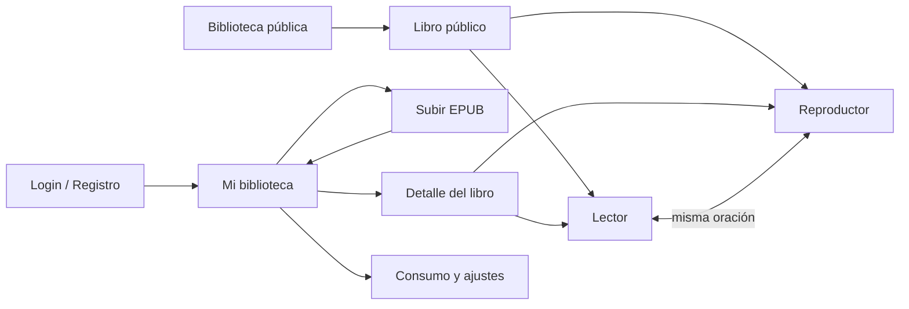

# Lectio — Diseño del Frontend

*Lector, reproductor, sincronización entre ambos y uso sin conexión.*

> Complementa `lectio-arquitectura-api.md` (contratos), `lectio-pipeline-limpieza.md` §4.1 (alineación) y `lectio-decision-tts.md` §6 (cuota y prefetch).

---

## 1. Plataforma: una app web instalable (PWA)

### 1.1 Decisión

Lectio se construye como **una sola app web, instalable como PWA**. No se desarrollan un ejecutable de escritorio ni una app nativa en el MVP.

| Opción | Evaluación |
|---|---|
| **App web + PWA** | **Elegida.** Una sola base de código para escritorio y móvil. En Android se instala desde Chrome con ícono propio, pantalla completa, audio en segundo plano, controles en la pantalla de bloqueo y modo sin conexión. Se despliega como sitio estático, sin tiendas ni revisiones. |
| Ejecutable de escritorio (Electron / Tauri) | Descartada. En escritorio el navegador cubre el caso de uso; empaquetar agrega instaladores, firma de código y auto-actualización sin ningún beneficio para el usuario. |
| App nativa / APK (React Native, Kotlin) | Descartada para el MVP. Duplicaría el frontend y agregaría publicación en tiendas. Si en el futuro se quiere estar en Play Store, la misma PWA se publica envuelta en una **TWA** (Trusted Web Activity, con Bubblewrap) o con **Capacitor**, sin reescribir la app. |

**Para el portafolio:** una URL se abre en segundos; un APK casi nadie lo instala para revisar un proyecto.

### 1.2 Lo que la PWA debe resolver para ser útil de verdad

El caso de uso central es escuchar en el gym o manejando: celular, pantalla apagada, a veces sin señal. Estas capacidades no son extras, son la condición para que la app se use más de una semana:

1. **Audio en segundo plano** con la pantalla bloqueada.
2. **Controles en la pantalla de bloqueo y en el auto** (Media Session API): play/pausa, ±15 s, capítulo anterior y siguiente.
3. **Escucha sin conexión** de capítulos descargados.
4. **Continuidad**: cambiar de leer a escuchar (y viceversa) en un toque, desde la misma oración.

### 1.3 Advertencia sobre iOS

Android con Chrome soporta todo lo anterior. En iOS (Safari, PWA añadida a pantalla de inicio) hay limitaciones históricas: el audio en segundo plano ha tenido comportamientos inconsistentes entre versiones, y el almacenamiento de sitios **no instalados** puede borrarse tras días sin uso (las PWA añadidas a la pantalla de inicio están exentas de esa regla). **A validar en un iPhone real** antes de prometer el caso de uso en iOS. Si falla, la salida es la misma: envolver con Capacitor.

---

## 2. Stack

| Necesidad | Elección | Motivo |
|---|---|---|
| Framework | **React + React Router v7 (modo framework), sobre Vite** | Mantiene Vite (como ya prevé la documentación) y permite **prerenderizar** rutas concretas. Resuelve el SEO de la biblioteca pública (RF-21) sin montar un servidor de SSR. |
| PWA / Service Worker | `vite-plugin-pwa` (Workbox) | Precarga del app shell, estrategias de caché declarativas, soporte de `Range` para audio (ver §6.3). |
| Estado del servidor | TanStack Query | Caché, reintentos y **polling** del estado de procesamiento y de generación de audio. |
| Estado del reproductor | Zustand | Estado global pequeño y fuera del árbol de rutas: el audio sigue sonando al navegar. |
| Almacenamiento local | IndexedDB (vía `idb`) + Cache Storage | Capítulos descargados, alineaciones y cola de progreso pendiente de sincronizar. |
| Sanitización (defensa en profundidad) | DOMPurify | El backend ya sanitiza `content_html`; se vuelve a sanitizar al renderizar. |
| Estilos | Tailwind CSS | Rápido de iterar; temas claro/oscuro/sepia con variables CSS. |
| Tipos | `packages/shared` | Mismos DTOs que la API, sin duplicar. |

**Alternativa válida:** Next.js (App Router). Más conocido en ofertas laborales, pero trae su propia capa de servidor (server actions, rutas de API) que se superpone con NestJS y enturbia la separación backend/frontend que el proyecto quiere mostrar. Con React Router el frontend es un cliente puro de la API.

### 2.1 Estrategia de renderizado por ruta

| Rutas | Renderizado | Por qué |
|---|---|---|
| `/`, `/biblioteca-publica`, `/libros/:slug` (públicos) | **Prerender en build** (HTML estático) | Indexables por buscadores (RF-21). El catálogo público cambia solo cuando el equipo carga un libro, lo que dispara un nuevo build. |
| Todo lo autenticado | SPA (render en cliente) | No necesita SEO; es una app. |

Resultado: el frontend completo se despliega como **sitio estático** (Cloudflare Pages, Netlify o similar), gratis a esta escala.

---

## 2.2 Dirección visual

*Decidida el 25-09-2026; se ensaya primero en `lectio preview` (CLI) y luego se aplica a la app.*

**Idea:** el equilibrio entre un libro bien impreso (editorial cálido) y la legibilidad de una herramienta de accesibilidad (alto contraste). Más adelante, la app podrá permitir que cada usuario incline la balanza hacia uno u otro lado.

| Elemento | Decisión |
|---|---|
| Tipografía del texto | **Literata**: serif diseñada para leer en pantalla. |
| Tipografía de la interfaz | **Atkinson Hyperlegible**: creada para personas con baja visión. |
| Fondo (tema claro) | Crema / papel, sin llegar a amarillo. |
| Acento | **Azul tinta**: enlaces, oración que suena, botones. Contraste AA como mínimo y AAA en el texto. |
| Tema | Sigue la preferencia del sistema, con un botón para cambiarlo. El oscuro es **cálido** (café muy oscuro, texto marfil), no negro puro. |
| Lectura | Letra base grande (~20 px), interlineado ~1,6, línea de ~65 caracteres, controles A− / A+. |
| Navegación | Índice lateral de capítulos (las secciones ocultas en gris) y el capítulo al lado. |
| Marcas de revisión (preview) | Sutiles y activables: por defecto se lee como un libro; en "modo revisión" se ve qué se omite, las notas y el anuncio de cada capítulo. |

## 3. Pantallas



| Pantalla | Contenido clave |
|---|---|
| **Biblioteca pública** | Portada, título, autor, idioma. Llamado a la acción: "Escuchar ahora", sin registro. Es la landing y la demo. |
| **Mi biblioteca** | Libros con portada y progreso ("Cap. 3 de 12 · escuchando"). Estados `pending`/`processing` con indicador; `error` con mensaje según `errorCode` (ej. DRM, ver §8). |
| **Subir EPUB** | Arrastrar y soltar o selector de archivo; progreso de subida; tras el `202`, el libro aparece en la biblioteca en estado "procesando" (polling). Aviso si el libro ya existe (`409 BOOK_ALREADY_EXISTS` → enlace al existente). |
| **Detalle del libro** | Lista de capítulos narrativos con `parentTitle` como agrupador; por capítulo: estado del audio y duración; botón "Generar audio" que muestra antes el costo en caracteres y la cuota restante. Enlace discreto "Mostrar secciones ocultas" (front/back matter) y "Ver reporte de procesamiento". |
| **Lector** | Ver §4. |
| **Reproductor** | Mini-reproductor persistente en la parte inferior de toda la app + vista expandida. Ver §5. |
| **Consumo y ajustes** | Barra de cuota del mes (consumido / reservado / restante, fecha de reinicio), voz por defecto, preferencias de lectura, espacio usado por descargas y botón para liberarlo. |

---

## 4. Lector

### 4.1 Renderizado

- `contentHtml` se sanitiza de nuevo con DOMPurify y se inserta en un contenedor con tipografía de lectura (ancho máximo ~65 caracteres, interlineado amplio).
- **Preferencias** (persistidas en `localStorage`): tamaño de letra, fuente (serif, sans, fuente para dislexia), tema (claro, sepia, oscuro), interlineado. Pensado también para el público con fatiga visual definido en la idea de producto.
- **Notas al pie:** las llamadas a nota son enlaces a `notes[].id`; al tocarlas se abre un popover con la nota, sin perder la posición de lectura.
- Navegación: capítulo anterior / siguiente e índice lateral.

### 4.2 Seguimiento de la posición

- Un `IntersectionObserver` observa los bloques `[data-b]`. La posición actual es la **primera oración del primer bloque visible** (se obtiene de `sentences` filtrando por `blockIndex`).
- El progreso se envía con `PUT /books/:id/progress` **con debounce** (cada ~10 s si cambió) y, además, en `visibilitychange` → `hidden` (el usuario cambia de app o bloquea el celular), usando `fetch(..., { keepalive: true })` para que la petición sobreviva al cierre de la página.
- Sin conexión, el progreso se guarda en la cola local (§6.4).

### 4.3 Resaltado de oraciones

Para marcar la oración que se está escuchando se usa la **CSS Custom Highlight API** (`CSS.highlights`):

1. Con `sentences[i]` se obtienen `blockIndex`, `start` y `end`.
2. Se recorre el texto del bloque `[data-b=blockIndex]` para construir un `Range` desde el offset `start` hasta `end` (atravesando nodos inline como `<em>` sin problema).
3. Se registra el rango en `CSS.highlights.set('current-sentence', new Highlight(range))`, y el estilo se define con `::highlight(current-sentence)`.

Ventaja: **no modifica el DOM** (no se envuelven oraciones en `<span>`, que se rompe cuando una oración cruza etiquetas inline). Si el navegador no soporta la API, el respaldo es resaltar el bloque completo con una clase CSS.

---

## 5. Reproductor

### 5.1 Arquitectura

- Un **único elemento `<audio>`** montado en la raíz de la app, fuera de las rutas, controlado desde un store de Zustand (`currentBook`, `currentChapter`, `alignment`, `playbackRate`, `status`). Navegar por la app no interrumpe el audio.
- **Controles:** play/pausa, ±15 s, oración anterior / siguiente (usando la alineación), capítulo anterior / siguiente, velocidad de 0,75x a 3x (RF-17), **temporizador de apagado** (fin del capítulo, 15, 30 o 60 min), muy usado al escuchar antes de dormir.
- **Avance automático:** al terminar un capítulo, si el siguiente tiene audio `ready`, continúa solo; si no, muestra "Generando el siguiente capítulo..." con polling.

### 5.2 Media Session (pantalla de bloqueo, auto, auriculares)

```typescript
navigator.mediaSession.metadata = new MediaMetadata({
  title: chapter.title,
  artist: book.author,
  album: book.title,
  artwork: [{ src: book.coverUrl, sizes: '512x512', type: 'image/jpeg' }],
});
navigator.mediaSession.setActionHandler('play', play);
navigator.mediaSession.setActionHandler('pause', pause);
navigator.mediaSession.setActionHandler('seekbackward', () => seekBy(-15));
navigator.mediaSession.setActionHandler('seekforward', () => seekBy(15));
navigator.mediaSession.setActionHandler('previoustrack', previousChapter);
navigator.mediaSession.setActionHandler('nexttrack', nextChapter);
navigator.mediaSession.setActionHandler('seekto', (d) => seekTo(d.seekTime!));
// y en cada timeupdate (limitado): setPositionState({ duration, position, playbackRate })
```

Esto es lo que hace que los controles del auto (Bluetooth) y de los auriculares funcionen.

### 5.3 Prefetch del siguiente capítulo

Al pasar el **70 %** del capítulo actual, el reproductor:
1. Si el siguiente capítulo no tiene audio, lo solicita (`POST /chapters/:id/audio`), respetando la cuota y el límite de concurrencia (`lectio-decision-tts.md` §6.5).
2. Si la respuesta es `429 TTS_QUOTA_EXCEEDED`, avisa **antes** de que termine el capítulo actual: "Tu cuota del mes no alcanza para el capítulo 8 (faltan 14.240 caracteres). Se reinicia el 1 de octubre."
3. Si el libro está marcado para escucha sin conexión, descarga también el siguiente capítulo (§6).

---

## 6. Sincronización lectura ↔ audio

### 6.1 Interacciones

| Acción del usuario | Qué pasa |
|---|---|
| Está leyendo y toca **"Escuchar desde aquí"** | Toma el `sentenceIndex` actual (§4.2) → busca en `alignment.sentences` la primera entrada con `index ≥ sentenceIndex` → `audio.currentTime = startMs / 1000` → play. |
| Mantiene presionada una oración en el lector | Menú contextual "Escuchar desde esta oración" (mismo mecanismo). |
| Está escuchando y abre el lector | Búsqueda binaria de `currentTime` en `alignment.sentences` → oración actual → scroll a su bloque y resaltado. |
| Escucha con el lector abierto (**modo seguimiento**) | En cada `timeupdate` (limitado a ~4 por segundo): búsqueda binaria → actualiza el resaltado y hace auto-scroll suave. Si el usuario hace scroll manual, el seguimiento se pausa y aparece el botón "Volver a la oración actual". |
| Vuelve a abrir el libro otro día | `GET /books/:id/progress` → abre en el `mode` guardado (lector o reproductor) en la oración guardada. |

### 6.2 Lógica pura y testeable

Las conversiones viven en funciones puras del frontend, sin dependencias del DOM:

```typescript
// Primera oración narrada en o después de sentenceIndex → tiempo de inicio.
function sentenceToTime(alignment: Alignment, sentenceIndex: number): number;

// Oración que suena en el instante dado (búsqueda binaria sobre startMs).
function timeToSentence(alignment: Alignment, timeMs: number): number;
```

Ambas deben manejar los huecos: oraciones con `narration` vacía (un DOI, por ejemplo) no tienen entrada en la alineación.

### 6.3 Sin conexión

**Qué se descarga por capítulo:** el JSON del capítulo (`GET /chapters/:id`), el audio y el `alignment.json`.

- **Botón "Descargar"** por capítulo y por libro ("descargar los próximos 3 capítulos"). El usuario decide; no se descarga todo automáticamente, porque un libro completo puede pesar cientos de MB.
- **Dónde:** Cache Storage para audio y alineación; IndexedDB para el índice de descargas (qué capítulo, tamaño, fecha).
- **Clave de caché estable:** las URLs de audio privadas son firmadas y expiran, así que la caché se indexa por `audioSegmentId`, no por URL.
- **Detalle técnico crítico: peticiones `Range`.** Para avanzar o retroceder, el `<audio>` pide trozos del archivo con la cabecera `Range`. Un audio servido desde el Service Worker debe responder `206 Partial Content`; si no, el reproductor no puede adelantar en modo sin conexión (y en Safari puede ni siquiera reproducir). Se resuelve con el `RangeRequestsPlugin` de Workbox.
- **Persistencia:** al primer uso de descargas se pide `navigator.storage.persist()` para que el navegador no borre los archivos ante poco espacio. La pantalla de ajustes muestra el espacio usado (`navigator.storage.estimate()`).

### 6.4 Progreso sin conexión

- Los `PUT /progress` que fallan por falta de red se guardan en una cola en IndexedDB `{ bookId, chapterId, sentenceIndex, mode, clientUpdatedAt }`.
- Al recuperar la conexión (`online`), se envía **solo el último** por libro.
- **Conflictos** (se escuchó sin conexión en el celular y se leyó en el computador): gana el `updatedAt` más reciente. Requiere que la API acepte `clientUpdatedAt` y lo compare con el guardado (ver §9).

---

## 7. Estado de procesos asíncronos (polling)

Las operaciones largas (procesar un libro, generar un audio) responden `202` y luego se consulta el estado (RF-12). Con TanStack Query:

- `refetchInterval` dinámico: cada 2 s mientras el estado es `pending`/`processing`, se detiene en `ready`/`error`.
- El polling se pausa si la pestaña está oculta (comportamiento por defecto de TanStack Query) para no gastar batería.
- Al completarse, se invalida la consulta del detalle del libro para refrescar los estados de los capítulos.

WebSockets o Server-Sent Events quedan para v2.1 (tiempo real); el polling es suficiente y más simple para el MVP.

---

## 8. Manejo de errores

El frontend decide los mensajes por `code` (estable), no por `message`:

| `code` | Mensaje al usuario |
|---|---|
| `DRM_PROTECTED` | "Este libro tiene DRM y no puede procesarse. Lectio funciona con EPUB sin protección." |
| `INVALID_ARCHIVE` / `MISSING_PACKAGE` | "El archivo no es un EPUB válido o está dañado." |
| `NO_TEXT_CONTENT` | "No encontramos texto legible en este libro." |
| `BOOK_ALREADY_EXISTS` | "Ya tienes este libro." + enlace. |
| `TTS_QUOTA_EXCEEDED` | "Te faltan N caracteres para este capítulo. Tu cuota se reinicia el {resetsAt}." |
| `AUDIO_CONCURRENCY_LIMIT` | "Ya hay capítulos generándose; espera a que terminen." |
| Error de red | Se reintenta en silencio; si persiste: "Sin conexión. Tus capítulos descargados siguen disponibles." |

---

## 9. Cambios requeridos en el backend

> **Estado:** incorporados en `lectio-arquitectura-api.md` (§1.7, §1.9–1.11, §2.2, §2.5) y `lectio-modelo-datos.md` (`RefreshToken`, `Book.slug`, `ReadingProgress.client_updated_at`).

| Cambio | Motivo |
|---|---|
| **Refresh token** en cookie `httpOnly` + `POST /auth/refresh` y `POST /auth/logout` | La API actual solo emite un access token. Una PWA que se usa a diario no puede pedir login cada vez que expira. El access token vive en memoria; el refresh token en cookie `httpOnly`, `Secure`, `SameSite`. |
| **CORS** configurado para el dominio del frontend (con credenciales para la cookie) | Frontend y API en dominios distintos. |
| Storage de audio con soporte de **`Range`** y cabeceras CORS | Para reproducir, adelantar y cachear el audio desde el Service Worker. |
| `PUT /books/:id/progress` acepta `clientUpdatedAt` y solo sobrescribe si es más reciente | Resolución de conflictos del progreso sin conexión (§6.4). |
| `ETag` / `Cache-Control` en `GET /chapters/:id` | El contenido del capítulo solo cambia si se reprocesa el libro; evita descargarlo de nuevo. |
| Slug legible en libros públicos (`/libros/don-quijote`) | URLs indexables y compartibles. |
| Endpoint o manifiesto de catálogo público para el build | El prerender necesita la lista de libros públicos en tiempo de build. `GET /books/public` ya sirve. |

---

## 10. Pruebas

| Tipo | Herramienta | Qué cubre |
|---|---|---|
| Unitarias | Vitest | `sentenceToTime`, `timeToSentence` (incluyendo huecos), construcción de `Range` desde offsets, cola de progreso sin conexión. |
| Componentes | Testing Library | Lector (resaltado, notas), reproductor (controles, temporizador), estados de error por `code`. |
| End-to-end | Playwright | Flujo completo: subir EPUB → procesamiento → generar audio → escuchar → cambiar a leer en la misma oración. **Modo sin conexión** (Playwright puede simular `offline`): descargar capítulo, cortar la red, reproducir y adelantar. |
| Manual en dispositivo | Android (Chrome) e iPhone (Safari, PWA instalada) | Pantalla bloqueada, controles del auto/auriculares, sin conexión. No se puede automatizar de forma fiable. |

---

## 11. Accesibilidad

Parte del público objetivo tiene fatiga o dificultad visual, así que la accesibilidad es un requisito, no un extra:

- Todos los controles accesibles por teclado y con etiquetas para lectores de pantalla.
- Los cambios de estado ("Audio listo", "Procesando libro") se anuncian con `aria-live`.
- Contraste AA en todos los temas; tamaño de letra ajustable sin romper el diseño.
- `prefers-reduced-motion` desactiva el auto-scroll animado del modo seguimiento (salta en vez de desplazarse).

---

## 12. Fuera de alcance del MVP

- Publicación en Play Store (TWA / Capacitor) y App Store.
- Resaltado a nivel de palabra (la alineación por oración cubre la sincronización).
- Subrayados y notas del usuario (v2.1).
- Sincronización en tiempo real entre dispositivos abiertos a la vez (v2.1).
- Selección de voz por capítulo o previsualización de voces.

## 13. Decisiones abiertas

| Decisión | Opciones | Criterio |
|---|---|---|
| Framework | React Router v7 (recomendado) / Next.js | Separación limpia frontend-backend vs. reconocimiento en el mercado laboral. |
| Soporte iOS en el MVP | Garantizado / "mejor esfuerzo" | Resultado de la prueba en un iPhone real (§1.3). |
| Descarga automática | Manual (recomendado) / próximos N capítulos automáticamente | Espacio en el dispositivo vs. comodidad. |
