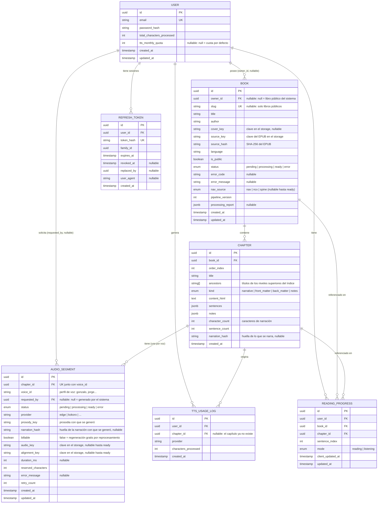

# Lectio — Modelo de Datos Detallado

> Versión alineada con `lectio-pipeline-limpieza.md` (salidas de lectura y narración, sincronización por oración) y `lectio-decision-tts.md` (cuota mensual y control de consumo).

## 1. Diagrama entidad-relación

---

## 2. Detalle de entidades

### 2.1 `User`
Representa una cuenta. No requiere roles diferenciados en el MVP (no hay admin visible al usuario; la carga de libros públicos se hace por un proceso interno, no por una UI de administración).

| Campo | Tipo | Notas |
|---|---|---|
| `id` | uuid (PK) | |
| `email` | string, único | |
| `password_hash` | string | Nunca se expone en respuestas de API. |
| `total_characters_processed` | int, default 0 | Contador histórico acumulado, ver §3. |
| `tts_monthly_quota` | int, nullable | Cuota mensual de caracteres TTS. `null` = se usa la cuota por defecto de configuración (ej. 300.000). Permite dar más cuota a un usuario concreto (a ti mismo, por ejemplo) sin introducir aún el concepto de "plan". |
| `created_at` / `updated_at` | timestamp | |

### 2.2 `Book`
Un libro, ya sea privado (subido por un usuario) o público (dominio público, precargado por el equipo).

| Campo | Tipo | Notas |
|---|---|---|
| `id` | uuid (PK) | |
| `owner_id` | uuid (FK → User), **nullable** | `null` cuando `is_public = true` y el libro pertenece al catálogo del sistema. |
| `slug` | string, único, nullable | Identificador legible para URLs públicas (`/libros/don-quijote`). Obligatorio si `is_public = true`, `null` en libros privados (no tiene sentido una URL legible para un libro que nadie más puede ver). |
| `title`, `author` | string | Extraídos del metadata OPF (pipeline, etapa 2). |
| `cover_key` | string, nullable | Clave de la portada en el storage, extraída del EPUB. Se guardan claves y no URLs: las de libros privados se firman en cada petición. |
| `source_key` | string | Clave del `.epub` original en el storage. |
| `source_hash` | string | SHA-256 del archivo. Permite detectar que un usuario sube dos veces el mismo libro (se le avisa en vez de duplicarlo) y deja preparada la deduplicación entre usuarios evaluada para v1.1. |
| `language` | string | Código ISO 639-1, del OPF o detectado a partir del texto. Determina la voz por defecto y el segmentador de oraciones. |
| `is_public` | boolean, default `false` | Determina si aparece en la biblioteca pública sin autenticación. |
| `status` | enum | `pending` (recién subido) → `processing` (pipeline en curso) → `ready` / `error`. |
| `error_code` | string, nullable | Código estable para que el frontend muestre un mensaje adecuado: `INVALID_ARCHIVE`, `MISSING_PACKAGE`, `DRM_PROTECTED`, `NO_TEXT_CONTENT`, `PROCESSING_TIMEOUT`. |
| `error_message` | string, nullable | Detalle técnico (no se muestra tal cual al usuario). |
| `nav_source` | enum, nullable | De dónde salió la tabla de contenidos: `nav` (EPUB 3), `ncx` (EPUB 2) o `spine` (respaldo, sin TOC utilizable). |
| `pipeline_version` | int | Versión del pipeline que procesó el libro. Cuando mejoran las reglas, `pnpm reprocess:books` reprocesa los libros `ready` con una versión anterior (`lectio-arquitectura-api.md` §1.5, flujo de reprocesamiento; §4 abajo). |
| `processing_report` | jsonb, nullable | Reporte del pipeline: reglas aplicadas, cantidades eliminadas, fallbacks y warnings (ver pipeline §6). |

**Regla de negocio:** si `is_public = true`, `owner_id` debe ser `null` y `slug` no puede ser `null`. Se valida a nivel de aplicación.

### 2.3 `Chapter`
Un capítulo segmentado según la tabla de contenidos, con sus dos salidas: lectura y narración (pipeline, etapas 4–9).

| Campo | Tipo | Notas |
|---|---|---|
| `id` | uuid (PK) | |
| `book_id` | uuid (FK → Book) | |
| `order_index` | int | Orden real según la posición en el spine (no el orden declarado del TOC, que puede venir desordenado). |
| `title` | string | Título del capítulo (del `nav`/NCX, o del primer heading en el respaldo por spine). |
| `ancestors` | string[] | Títulos de los niveles superiores del TOC, del más externo al más cercano, para mostrar contexto: "Segunda parte › Capítulo 7". (El diseño inicial tenía un solo `parent_title`; el pipeline entrega la ruta completa.) |
| `classification` | jsonb | Evidencia de la clasificación: señal, confianza y motivo (pipeline, etapa 5). Se muestra en el reporte. |
| `kind` | enum | `narrative` / `front_matter` / `back_matter` / `notes` (pipeline, etapa 5). Solo los `narrative` se muestran por defecto; los demás se conservan (principio no destructivo). |
| `content_html` | text | HTML sanitizado para el lector: conserva formato, imágenes y llamadas a nota como enlaces. Cada bloque de texto lleva `data-b="<índice>"`. |
| `sentences` | jsonb | Array de oraciones: `{ index, blockIndex, start, end, text, narration }`. `narration = ""` significa que la oración no se narra. Es la base de la sincronización. |
| `notes` | jsonb | Notas al pie extraídas del flujo: `[{ id, html }]`. El lector las muestra en un popover; la narración las omite. |
| `character_count` | int | **Caracteres de narración** (suma de `sentences[].narration`): lo que realmente se envía a TTS. Se usa para verificar la cuota antes de encolar. |
| `sentence_count` | int | Precalculado para mostrar el progreso ("oración 143 de 612") sin leer el jsonb. |
| `narration_hash` | string, nullable | Huella de lo que se envía a TTS: las oraciones narradas con su bloque, su narración y sus tramos de voz (`narrationFingerprint` del pipeline). Al reprocesar, si cambia, el audio generado con la anterior queda obsoleto. `null` en capítulos procesados antes de que existiera (se completa al reprocesar). |

**Por qué `sentences` en jsonb y no en una tabla `Sentence`:** siempre se leen completas junto al capítulo, nunca se consultan individualmente, y un libro puede tener decenas de miles. Una tabla aparte multiplicaría filas sin ningún beneficio de consulta.

### 2.4 `AudioSegment`
El audio generado para un capítulo **con una voz**: uno por (capítulo, voz). Volver a una voz ya generada es instantáneo (el lector cambia de audio en la misma oración) y cada generación cuenta para la cuota. Cambió respecto del diseño inicial, que tenía uno solo por capítulo: el lector ya ofrece elegir la voz (`lectio-decision-tts.md` §7.5).

| Campo | Tipo | Notas |
|---|---|---|
| `id` | uuid (PK) | |
| `chapter_id` | uuid (FK → Chapter) | Único junto con `voice_id`. |
| `requested_by` | uuid (FK → User), nullable | Quién solicitó la generación. `null` para el audio de libros públicos, generado por el proceso interno. Se usa para el límite de concurrencia y la reserva de cuota. |
| `status` | enum | `pending` → `processing` → `ready` / `error`. |
| `provider` | string | Proveedor que generó el audio (`edge`, `kokoro`…). Con el router y su circuit breaker, un mismo libro puede tener capítulos de proveedores distintos; conviene saberlo. |
| `voice_id` | string | Perfil de voz de Lectio (`gonzalo`, `jorge`, `salome`, `salome-grave`) o una voz de Edge. |
| `prosody_key` | string, nullable | Resumen de la prosodia con que se generó. Si el perfil cambia (por ejemplo, su velocidad), el audio queda obsoleto y se regenera al pedirlo. |
| `narration_hash` | string, nullable | Huella de las oraciones con que se generó (las que leyó el worker al empezar). Distinta de `Chapter.narration_hash` = obsoleto por cambio de narración; si alguna de las dos es `null` no hay con qué comparar y se da por vigente. |
| `billable` | boolean, default `true` | `false` cuando es una regeneración por cambio de narración (reprocesamiento): no reserva cuota y al quedar `ready` no genera `TtsUsageLog` ni suma a `total_characters_processed`. |
| `audio_key` | string, nullable | Clave del MP3 en el storage; solo con `status = ready`. Se guardan claves y no URLs porque las de libros privados se firman en cada petición y vencen. |
| `alignment_key` | string, nullable | Clave de `alignment.json`, con los tiempos de cada oración (pipeline, etapa 11). |
| `duration_ms` | int, nullable | Duración total en milisegundos (misma unidad que la alineación). |
| `reserved_characters` | int | Caracteres reservados de la cuota del solicitante mientras el audio está en `pending`/`processing`. Se fija al encolar (copia de `Chapter.character_count`) para que la reserva no cambie si el capítulo se reprocesa en paralelo. |
| `retry_count` | int, default 0 | Para la política de reintentos (RNF-04). |
| `error_message` | string, nullable | |

### 2.5 `ReadingProgress`
Posición de un usuario en un libro. **Una fila por combinación usuario+libro** (se actualiza, no se acumula histórico en el MVP).

| Campo | Tipo | Notas |
|---|---|---|
| `id` | uuid (PK) | |
| `user_id` | uuid (FK → User) | |
| `book_id` | uuid (FK → Book) | |
| `chapter_id` | uuid (FK → Chapter) | Capítulo actual. |
| `sentence_index` | int | Oración actual dentro del capítulo. **Una sola posición válida tanto para leer como para escuchar**: el `alignment.json` la convierte en un tiempo del audio y viceversa (pipeline §4.1). |
| `mode` | enum | `reading` / `listening`: último modo usado, para reabrir el libro en la misma interfaz. |
| `client_updated_at` | timestamp | Momento en que el usuario estuvo en esa posición, informado por el cliente. Resuelve conflictos entre dispositivos: una actualización solo se aplica si su `client_updated_at` es posterior al guardado (útil cuando el celular envía horas después un progreso guardado sin conexión). |
| `updated_at` | timestamp | Momento en que el servidor escribió la fila. |

**Restricción:** único por (`user_id`, `book_id`).

**Por qué no se guardan dos offsets (texto y audio):** con dos offsets independientes, leer 20 minutos y luego darle a "play" reanuda el audio donde se dejó de *escuchar*, no donde se dejó de *leer*. El índice de oración elimina esa desincronización por construcción.

**Nota sobre la biblioteca pública:** un usuario autenticado que lee un libro público también genera su propio `ReadingProgress`. Un visitante sin autenticar no persiste progreso en el servidor (el frontend puede recordarlo localmente).

### 2.6 `TtsUsageLog`
Registro de cada generación de audio completada, para trazabilidad y para calcular el consumo mensual.

| Campo | Tipo | Notas |
|---|---|---|
| `id` | uuid (PK) | |
| `user_id` | uuid (FK → User) | Quién solicitó la generación. |
| `chapter_id` | uuid (FK → Chapter), nullable | Qué capítulo se procesó. Pasa a `null` si el capítulo se borra (se quitó al reprocesar o se borró el libro): el consumo del mes no puede desaparecer con él. Antes era `ON DELETE CASCADE`, y borrar un libro con audio devolvía la cuota del mes. |
| `provider` | string | Proveedor usado; permite calcular costo real por proveedor. |
| `characters_processed` | int | Caracteres de narración efectivamente enviados. |
| `created_at` | timestamp | Define a qué periodo mensual pertenece el consumo. |

Solo se inserta cuando el audio queda `ready`, en la **misma transacción** que actualiza `AudioSegment.status` e incrementa `User.total_characters_processed`. Así un reintento nunca cuenta dos veces el mismo consumo. El audio de libros públicos (`requested_by = null`) y la regeneración por cambio de narración (`billable = false`) no generan `TtsUsageLog`.

### 2.7 `RefreshToken`
Sesiones de larga duración para la PWA (`lectio-arquitectura-api.md` §1.9).

| Campo | Tipo | Notas |
|---|---|---|
| `id` | uuid (PK) | |
| `user_id` | uuid (FK → User) | |
| `token_hash` | string, único | SHA-256 del token. El token en claro solo existe en la cookie del usuario; una filtración de la base de datos no permite suplantar sesiones. |
| `family_id` | uuid | Todos los tokens nacidos de un mismo login comparten familia. Si se reutiliza un token ya rotado, se revoca la familia completa. |
| `expires_at` | timestamp | Ej. 30 días desde la emisión. |
| `revoked_at` | timestamp, nullable | Se llena al rotar, al cerrar sesión o al detectar reutilización. |
| `replaced_by` | uuid, nullable | Token que lo reemplazó en la rotación (trazabilidad). |
| `user_agent` | string, nullable | Para una futura lista de "sesiones activas" por dispositivo. |

Los tokens vencidos o revocados se purgan periódicamente (ej. un job diario que borra los expirados hace más de 7 días).

---

## 3. Cálculo de cuota y consumo

Para el periodo mensual en curso (del día 1 a las 00:00 UTC hasta el fin de mes):

| Magnitud | Cálculo |
|---|---|
| `consumed` | `SUM(TtsUsageLog.characters_processed)` del usuario con `created_at` dentro del periodo. |
| `reserved` | `SUM(AudioSegment.reserved_characters)` del usuario con `status IN (pending, processing)`. |
| `quota` | `User.tts_monthly_quota ?? cuota por defecto`. |
| `remaining` | `quota − consumed − reserved`. |

Una solicitud de audio se acepta si `Chapter.character_count ≤ remaining` y el usuario tiene menos de N segmentos en `pending`/`processing` (RF-23, RF-24). El chequeo y la creación del `AudioSegment` se hacen en una transacción con bloqueo por usuario (ej. `SELECT … FOR UPDATE` sobre la fila de `User`), para que dos solicitudes simultáneas no pasen ambas el chequeo.

`User.total_characters_processed` sigue siendo un contador histórico desnormalizado, para consultar el total sin sumar el log completo (RF-19). El consumo mensual se calcula desde el log porque el índice `(user_id, created_at)` lo hace barato.

---

## 4. Decisiones de diseño relevantes

- **`owner_id` nullable en `Book`** en vez de crear un usuario "sistema" ficticio: un libro público no es propiedad de nadie, y así se evita excluir artificialmente un usuario especial de cualquier lógica de "libros del usuario X".
- **El procesamiento se guarda, no se recalcula**: el pipeline corre una sola vez al subir el libro (job asíncrono) y persiste `content_html` y `sentences`. Leer un capítulo nunca reprocesa el EPUB. `pipeline_version` permite reprocesar a propósito cuando mejoran las reglas.
- **Reprocesar conserva los ids de los capítulos**: `ReadingProgress` y `AudioSegment` apuntan al capítulo, así que reemplazar `Chapter[]` (como al subir) los borraría en cascada. Los capítulos se emparejan por título respetando el orden (subsecuencia común más larga); los emparejados se actualizan en su lugar. Si la estructura cambió:
  - el progreso en un capítulo quitado pasa al que ocupa su posición (o al último), desde la oración 0, sin aviso en la interfaz; en uno conservado se recorta `sentence_index` si ahora tiene menos oraciones;
  - el audio de un capítulo quitado se borra (y sus archivos); su consumo queda en `TtsUsageLog` con `chapter_id = null`;
  - si hay audio generándose en un capítulo que se quitaría, el libro se posterga.
  El libro sigue `ready` durante todo el proceso, y si la versión nueva falla, se queda con la anterior.
- **Audio obsoleto por huella de narración, no por versión**: solo queda obsoleto el audio de los capítulos cuya narración cambió de verdad. Regenerarlo es gratis y a pedido del usuario (nada se regenera ni se cobra solo); el de los libros públicos lo vuelve a encolar el sistema.
- **Dos salidas por capítulo (`content_html` + `sentences`)** en lugar de un único texto limpio: el lector conserva formato y notas, mientras la narración omite lo que interrumpe (pipeline §1.1, principio no destructivo).
- **`AudioSegment` es uno por capítulo y voz, no un historial**: regenerar con la misma voz sobrescribe. Guardar cada voz permite cambiarla al instante en el lector.
- **Reserva de cuota sin tabla propia**: la reserva se deriva de los `AudioSegment` pendientes. No hay un contador de "reservado" que pueda desincronizarse si un worker muere a mitad de un job.
- **`TtsUsageLog` como tabla de eventos + contador desnormalizado en `User`**: rendimiento en la lectura del total sin perder trazabilidad por evento, proveedor y periodo.

---

## 5. Índices recomendados

| Tabla | Índice | Razón |
|---|---|---|
| `Book` | `(owner_id)` | Listar la biblioteca personal (RF-07). |
| `Book` | `(slug)` único | Resolver `/libros/:slug` de la biblioteca pública. |
| `Book` | `(is_public)` | Listar la biblioteca pública (RF-21). |
| `Book` | `(owner_id, source_hash)` | Detectar que un usuario sube el mismo libro dos veces. |
| `Book` | `(pipeline_version)` | Encontrar libros a reprocesar (`pnpm reprocess:books`). |
| `Chapter` | `(book_id, order_index)` | Recuperar capítulos de un libro en orden. |
| `AudioSegment` | `(chapter_id, voice_id)` único | Un audio por capítulo y voz. |
| `AudioSegment` | `(requested_by, status)` | Límite de concurrencia y cálculo de reserva (RF-23, RF-24). |
| `ReadingProgress` | `(user_id, book_id)` único | Restricción de negocio y búsqueda directa. |
| `TtsUsageLog` | `(user_id, created_at)` | Consumo del periodo mensual (RF-19, RF-23). |
| `RefreshToken` | `(token_hash)` único | Búsqueda al renovar la sesión. |
| `RefreshToken` | `(family_id)` | Revocar la familia completa ante reutilización. |

---

## 6. Notas sobre ORM

Dado el monorepo con `packages/shared` para tipos compartidos entre `api` (NestJS) y `web` (React), **Prisma** encaja mejor que TypeORM para este proyecto: genera tipos TypeScript automáticamente a partir del esquema, lo que reduce duplicación con los DTOs compartidos y da una experiencia de migración más simple para un proyecto de este tamaño. Soporta columnas `Json` (jsonb en PostgreSQL), necesarias para `sentences`, `notes` y `processing_report`.

Es una recomendación, no una obligación: TypeORM también es válido si prefieres el estilo de entidades por decoradores, más parecido a JPA/Hibernate de tu experiencia en Spring.

Lo que Prisma no expresa directamente, como el bloqueo `SELECT … FOR UPDATE` del chequeo de cuota, se resuelve con `$queryRaw` dentro de una `$transaction` interactiva.
