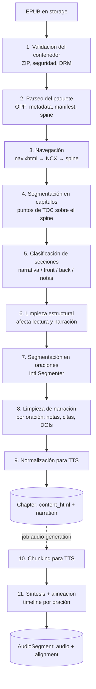

# Lectio — Pipeline de Procesamiento y Limpieza de Texto

*Diseño del componente diferencial del producto: cómo un EPUB se convierte en capítulos legibles y narrables.*

---

## 1. Propósito y alcance

El estudio de mercado (`informe-estudio-mercado-lectio.md`) concluye que la ventaja defendible de Lectio no es la calidad de voz, sino **respetar la estructura y la integridad narrativa del libro**. Este documento define el pipeline que materializa esa ventaja.

Cubre todo lo que ocurre dentro del job `book-processing` (desde el `.epub` en storage hasta los `Chapter` persistidos) y la preparación del texto que consume el job `audio-generation`.

**Requisitos que implementa:** RF-04, RF-05, RF-06, RF-13, RF-14, RF-15, RF-16, y habilita la sincronización lectura/audio (propuesta de valor "progreso unificado").

### 1.1 Principios de diseño

1. **Semántica antes que heurística.** Primero se usa lo que el EPUB declara explícitamente (`epub:type`, roles ARIA, `nav`, `landmarks`). Las heurísticas (regex, tamaños, repeticiones) son el respaldo, nunca la primera opción. Esto es exactamente lo que separa a Lectio de Speechify según el estudio.
2. **No destructivo.** Nada se borra del libro: se *clasifica*. El lector conserva las notas al pie (como enlaces), las imágenes y el formato. Solo la narración omite lo que interrumpe.
3. **Dos salidas desde una sola fuente.** Cada capítulo produce una versión de **lectura** (HTML sanitizado) y una de **narración** (secuencia de oraciones), ambas enlazadas por el mismo índice de oración. Ese índice es la clave de la sincronización.
4. **Etapas puras y trazables.** Cada etapa es una función pura `entrada → salida + reporte`. El pipeline completo emite un reporte de procesamiento por libro (qué se eliminó, qué regla lo hizo, qué fallbacks se usaron).
5. **Conservador ante la duda.** Un falso positivo (omitir texto narrativo real) es peor que un falso negativo (leer un número de página). Las reglas heurísticas se calibran para preferir no eliminar.

---

## 2. Vista general



Las etapas 1 a 9 corren en el worker `book-processing`, **una sola vez por libro**. Las etapas 10 y 11 corren en el worker `audio-generation`, **por capítulo y bajo demanda**.

---

## 3. Etapas del job `book-processing`

### Etapa 1 — Validación del contenedor

| Verificación | Detalle | Resultado si falla |
|---|---|---|
| Es un ZIP válido | Apertura con límites de seguridad (ver abajo). | Fatal: `INVALID_ARCHIVE` |
| Archivo `mimetype` | Contenido `application/epub+zip`. | Warning (muchos EPUB reales lo tienen mal); se continúa. |
| `META-INF/container.xml` | Debe apuntar a un `.opf` existente. | Fatal: `MISSING_PACKAGE` |
| DRM | Ver 3.1.1. | Fatal: `DRM_PROTECTED` |

**Límites de seguridad (obligatorios, el archivo viene de un usuario):**
- Tamaño máximo de subida (ej. 100 MB) y **tamaño descomprimido máximo** (ej. 500 MB) y número máximo de entradas: protección contra zip bombs.
- Rechazo de rutas con `..` o absolutas (path traversal) al resolver `href`.
- Parser XML con entidades externas deshabilitadas (XXE) y sin resolución de DTD remotas.
- Timeout total del job (ej. 2 min) para EPUB patológicos.

#### 3.1.1 Detección de DRM

Un EPUB con DRM no se puede leer, y el usuario debe recibir un mensaje claro en lugar de un "error de procesamiento" genérico.

- Existe `META-INF/encryption.xml` y cifra recursos **que no son fuentes** → DRM. La ofuscación de fuentes (algoritmos `http://www.idpf.org/2008/embedding` y `http://ns.adobe.com/pdf/enc#RC`) es legítima y **no** cuenta como DRM.
- Presencia de `META-INF/rights.xml` (Adobe ADEPT), `META-INF/license.lcpl` (Readium LCP) o `META-INF/sinf.xml` (Apple FairPlay) → DRM.

Mensaje al usuario: *"Este libro está protegido con DRM y no puede procesarse. Lectio funciona con EPUB sin protección (dominio público, tiendas DRM-free, o tus propias copias)."*

### Etapa 2 — Parseo del paquete (OPF)

Extrae:
- **Metadata:** `dc:title`, `dc:creator` (varios autores → se unen), `dc:language` (se normaliza a código ISO 639-1; si falta, se detecta a partir del texto del primer capítulo narrativo).
- **Manifest:** mapa `id → { href, media-type, properties }`.
- **Spine:** orden de lectura. Los ítems con `linear="no"` se marcan como no lineales (suelen ser notas o material auxiliar).
- **Portada:** en orden de preferencia: ítem con `properties="cover-image"` (EPUB 3) → `<meta name="cover" content="id">` (EPUB 2) → primera imagen del primer documento del spine si este es clasificado como `cover`. Sin portada → se genera una por defecto (título + autor).

### Etapa 3 — Navegación (tabla de contenidos)

Fuentes en orden de preferencia:

1. **EPUB 3 `nav.xhtml`**, elemento `<nav epub:type="toc">`.
2. **EPUB 2 `toc.ncx`**, `navMap`.
3. **Fallback al spine:** cada documento del spine lineal es un capítulo, y el título se toma del primer `<h1>`–`<h3>` del documento (o "Sección N").

> **Cambio respecto a RF-06:** hoy RF-06 dice que un EPUB sin TOC reconocible se rechaza. Se propone **no rechazar**, sino usar el fallback al spine y registrar un warning `TOC_FALLBACK_SPINE` en el reporte. Muchos EPUB generados por herramientas amateur traen un TOC vacío o roto, y rechazarlos castiga al usuario por un defecto que Lectio puede resolver. Solo es fatal si el spine tampoco tiene documentos con texto.

**Aplanado del árbol:** el TOC es jerárquico (Parte → Capítulo → Sección). Para el MVP, un "capítulo" de Lectio es el **nivel más profundo cuyo tamaño promedio supera un umbral** (ej. 2.000 caracteres), con un máximo de profundidad 2. Esto evita dos extremos: un libro dividido en 3 "Partes" gigantes, o uno troceado en 400 subsecciones de un párrafo. Los niveles superiores se conservan como `parent_title` para mostrar contexto ("Parte II › Capítulo 7").

**Landmarks (auxiliar):** si existe `<nav epub:type="landmarks">` (EPUB 3) o `<guide>` (EPUB 2), se leen para la etapa 5: indican dónde empieza el cuerpo (`bodymatter` / `type="text"`), la portada, el índice, etc.

### Etapa 4 — Segmentación en capítulos

Cada entrada del TOC apunta a `archivo.xhtml` o a `archivo.xhtml#fragmento`. La correspondencia *entrada de TOC = archivo* **no se cumple** en la práctica:

| Caso real | Ejemplo | Cómo se resuelve |
|---|---|---|
| Varios capítulos en un archivo | `libro.xhtml#cap1`, `libro.xhtml#cap2` | Se corta el DOM en el elemento con ese `id`. |
| Un capítulo repartido en varios archivos | Calibre divide archivos grandes: `cap3_split_000.xhtml`, `cap3_split_001.xhtml` | Los archivos del spine sin entrada propia se anexan al capítulo anterior. |
| Documentos del spine no referenciados en el TOC | Página de epígrafe entre capítulos | Igual: se anexan al capítulo anterior (o forman una sección previa si están antes del primer punto). |

**Algoritmo:**
1. Se construye un **flujo lineal** concatenando los documentos del spine lineal en orden.
2. Cada entrada del TOC (ya aplanado) se resuelve a una posición `(índice de spine, nodo DOM)` dentro de ese flujo.
3. Las entradas se ordenan por posición en el flujo (no por orden en el TOC, que a veces está desordenado; si difieren se registra warning `TOC_ORDER_MISMATCH`).
4. El capítulo *i* es el contenido desde la posición *i* hasta la posición *i+1* (exclusiva). El último llega hasta el final del flujo.
5. El contenido anterior a la primera entrada, si tiene texto, forma una sección inicial (que la etapa 5 casi siempre clasificará como front matter).

### Etapa 5 — Clasificación de secciones (RF-16)

Cada capítulo recibe un `kind`: `narrative`, `front_matter`, `back_matter` o `notes`. Solo los `narrative` aparecen por defecto en la lista de capítulos y en el flujo de "reproducir libro". **Los demás se guardan igual** (principio no destructivo) y el usuario puede mostrarlos.

Señales, en orden de precedencia (la primera que decide gana):

| Precedencia | Señal | Ejemplos |
|---|---|---|
| 1 | `epub:type` / `role` en el contenedor de la sección o en el `<body>` | `cover`, `titlepage`, `copyright-page`, `dedication`, `epigraph`, `toc`, `index`, `colophon`, `acknowledgments`, `bibliography`, `footnotes`, `endnotes`, `doc-endnotes`… |
| 2 | Landmarks / guide | La sección está antes del landmark `bodymatter` → `front_matter`; es `type="index"` → `back_matter`. |
| 3 | Título de la entrada de TOC (regex multilenguaje, anclado al título completo) | `^(índice|contenido|tabla de contenidos?|copyright|créditos|dedicatoria|agradecimientos|sobre el autor|notas|bibliografía)$`, y sus equivalentes en inglés. |
| 4 | Heurísticas de contenido | Muy corta (< 300 caracteres) y antes del primer capítulo largo → `front_matter`; mayoría de párrafos con patrón de nota (`^\d+\.\s`) → `notes`; densidad de enlaces internos alta → `toc`/`index`. |
| — | Sin señal | `narrative` (por defecto se asume narrativa: principio conservador). |

Las entradas cuyo `kind` se decidió por heurística (precedencia 4) quedan marcadas con `classification_confidence = "low"` en el reporte, útiles para calibrar reglas con el corpus de pruebas (sección 7).

### Etapa 6 — Limpieza estructural (afecta lectura y narración)

Opera sobre el DOM de cada capítulo. Lo que se elimina aquí **no es contenido del autor**, sino artefactos de maquetación, así que desaparece de ambas salidas.

| Regla | Detección semántica | Fallback heurístico |
|---|---|---|
| **S1. Números de página** (RF-13) | `epub:type="pagebreak"`, `role="doc-pagebreak"` | Elementos inline cuyo texto es solo un número o romano y cuyo `id`/`class` contiene `page`/`pag`/`pn`; bloques cuyo texto completo es `^\s*\d{1,4}\s*$`. |
| **S2. Encabezados repetidos** (RF-13) | — | (a) *Running headers*: bloques cuyo texto normalizado aparece idéntico al inicio o final de ≥ 30 % de los documentos del spine. (b) *Título duplicado por división*: si el primer heading de un documento anexado repite el título del capítulo, se elimina. |
| **S3. Elementos ocultos** | Atributo `hidden`, `aria-hidden="true"`, `display:none` inline | — |
| **S4. Notas al pie fuera del flujo** (RF-14) | Contenido con `epub:type` `footnote` / `endnote` / `rearnote`, `role="doc-footnote"` / `doc-endnote`, `<aside>` referenciado por un `noteref` | Destino de un enlace `<sup><a href="#x">` cuyo contenido es un número o símbolo y que está en una sección `notes` o al final del documento. |

**Tratamiento de las notas (S4), en detalle:** las notas **no se eliminan**. Se extraen del flujo principal y se agrupan en una lista `notes` del capítulo (`id`, `html`). En la salida de lectura, la llamada a nota queda como un enlace que abre la nota en un popover (lo que hacen los buenos lectores de EPUB). En la narración, tanto el contenido de la nota como la marca de la llamada se omiten (regla N1 de la etapa 8). Esto resuelve el reparo del estudio de mercado: la nota deja de interrumpir la frase, pero no se pierde.

**Salida de lectura (`content_html`):** tras S1–S4, el DOM se sanitiza con una lista blanca de etiquetas (`p`, `h1`–`h6`, `em`, `strong`, `i`, `b`, `blockquote`, `ul`, `ol`, `li`, `a`, `img`, `figure`, `figcaption`, `table` y sus hijos, `br`, `hr`, `span`, `sup`, `sub`), se eliminan scripts, estilos inline y atributos no permitidos, y se reescriben las rutas de imágenes a URLs de storage. Cada bloque de texto recibe un atributo `data-b="<índice>"` para anclar oraciones (etapa 7).

### Etapa 7 — Segmentación en oraciones

Esta etapa es la base de la sincronización lectura/audio.

- Se recorren los **bloques** del capítulo en orden (párrafos, encabezados, ítems de lista, citas). Cada bloque tiene un `textContent` normalizado.
- Cada bloque se divide en oraciones con **`Intl.Segmenter(language, { granularity: 'sentence' })`**, nativo en Node (sin dependencias). Se complementa con una lista de supresión de abreviaturas por idioma (`Sr.`, `Sra.`, `Dr.`, `pág.`, `etc.`, `Mr.`, `St.`…) para no cortar en ellas.
- Cada oración recibe:

```typescript
interface Sentence {
  index: number;        // índice global dentro del capítulo: la clave de sincronización
  blockIndex: number;   // corresponde a data-b en content_html
  start: number;        // offset de inicio dentro del textContent del bloque
  end: number;          // offset de fin (exclusivo)
  text: string;         // texto tal como se lee
  narration: string;    // texto a narrar (se llena en etapas 8 y 9); "" = no se narra
}
```

Como `start`/`end` se calculan sobre el mismo texto que ve el lector, el frontend puede resaltar la oración actual con la API `Range` sin necesidad de envolver cada oración en un `<span>` (que se rompe cuando una oración cruza un `<em>` u otra etiqueta inline).

**Bloques no narrables:** tablas, bloques de código, fórmulas y figuras sin caption se marcan con `narrate: false`. Sus oraciones existen (para mantener los índices) pero con `narration = ""`. Los `figcaption` sí se narran.

### Etapa 8 — Limpieza de narración (por oración)

Aplica solo a `narration`, nunca a `text`. Por eso trabaja oración a oración: si una regla vacía una oración completa, esa oración simplemente no tendrá audio, y la sincronización sigue funcionando.

| Regla | Qué elimina | Patrón / detección |
|---|---|---|
| **N1. Llamadas a nota** (RF-14) | La marca `¹`, `[3]`, `*` de un `noteref` | Semántica: el nodo `noteref` se excluye al construir `narration`. Fallback: `<sup>` con solo dígitos o símbolos dentro de un enlace interno. |
| **N2. DOIs** (RF-15) | `doi:10.1234/abc.567` | `\b(?:doi:\s*)?10\.\d{4,9}/\S+` |
| **N3. URLs y correos** (RF-15) | `https://…`, `www.…`, `x@y.com` | Regex estándar; se reemplaza por nada o, si la URL es el único contenido de la oración, la oración se vacía. |
| **N4. Citas parentéticas** (RF-15) | `(García et al., 2021, p. 112)`, `(Smith & Jones, 2019)` | Solo **entre paréntesis** y solo si el contenido completo encaja con `Apellido(s) [et al.\|y\|&\|and Apellido], año[letra][, p./pp. N[–M]]` (con variantes separadas por `;`). Nunca se tocan paréntesis que no encajen completos. |
| **N5. ISBN y avisos legales sueltos** (RF-15) | `ISBN 978-…`, `© 2020 Editorial X. Todos los derechos reservados.` | Solo en oraciones que consisten únicamente en eso (anclado `^…$`). |

N2–N5 son las reglas con más riesgo de falsos positivos. Cada una:
- se puede activar o desactivar de forma independiente (configuración por libro, preparada para una futura opción de usuario tipo "modo académico");
- registra en el reporte cuántas coincidencias tuvo y un muestreo de ejemplos;
- tiene casos negativos en el corpus de pruebas (ej. "(Madrid, 1605)" en una novela no debe eliminarse: no encaja con el patrón completo de apellido + año solo porque no hay apellido; "(1984)" tampoco).

### Etapa 9 — Normalización para TTS

Transformaciones sobre `narration` para que el sintetizador no tropiece:

- **Unicode:** normalización NFC; eliminación de guiones blandos (U+00AD), espacios de ancho cero y caracteres de control.
- **Letras capitulares (drop caps):** `<span class="dropcap">E</span>ra una vez` produce "E ra una vez" si se extrae ingenuamente. La extracción de texto inline se hace sin insertar espacios entre nodos inline adyacentes, y se unen los fragmentos de palabra partidos.
- **Guiones de división silábica** al final de línea en EPUB convertidos desde PDF (`conver-\nsión` → `conversión`), solo si la unión produce una palabra que ya aparece en el libro.
- **Espacios:** colapsar espacios múltiples y saltos de línea internos.
- **Anuncio de capítulo:** la primera "oración" narrada del capítulo es su título (`parent_title` + `title`, ej. "Parte dos. Capítulo siete: El despertar"), seguido de una pausa. Se genera como oración sintética con `blockIndex` del heading.
- **Numerales romanos en títulos:** "Capítulo IV" → "Capítulo 4", solo en títulos de capítulo, no en el cuerpo (donde "Luis XIV" debe quedarse como está y lo resuelve el TTS).
- **Escape** de `&`, `<`, `>` si el proveedor usa SSML (Edge TTS y Azure lo usan).

Lo que **no** se normaliza a propósito: números, fechas y abreviaturas del cuerpo. Los motores neuronales modernos los verbalizan mejor que cualquier regla propia, y reescribirlos arriesga introducir errores.

---

## 4. Etapas del job `audio-generation`

### Etapa 10 — Chunking para TTS

Un capítulo puede tener más de 50.000 caracteres, y los proveedores de TTS limitan el tamaño por solicitud. Se agrupan oraciones con `narration` no vacía en **chunks** de hasta `maxChunkChars` (valor del adaptador, no del dominio), respetando:

1. Nunca cortar una oración.
2. Preferir cortar en fin de párrafo (cambio de `blockIndex`) cuando el chunk ya supera el 70 % del máximo.
3. Una oración más larga que el máximo (raro: listas enormes sin puntuación) se divide en comas o punto y coma, y se registra warning.

**Cambio en el puerto `TtsProvider`:** el puerto actual recibe el capítulo completo. Se propone que reciba chunks y devuelva marcas de tiempo, para que el chunking y la alineación vivan en el dominio y no en cada adaptador:

```typescript
export interface TtsProvider {
  readonly maxChunkChars: number;
  synthesize(input: {
    text: string;
    voiceId: string;
    language: string;
  }): Promise<{
    audio: Buffer;               // formato común acordado (ej. MP3 24 kHz mono)
    durationMs: number;
    boundaries: Array<{          // offsets de palabra dentro de `text`
      textOffset: number;
      textLength: number;
      audioOffsetMs: number;
    }>;
  }>;
}
```

Si un proveedor no entrega marcas por palabra, el adaptador puede devolver `boundaries: []` y el dominio cae a la estrategia de respaldo (ver etapa 11).

### Etapa 11 — Síntesis, ensamblado y alineación

1. Se sintetiza cada chunk (secuencialmente, o con concurrencia limitada por proveedor).
2. Se concatenan los audios, acumulando el desplazamiento temporal de cada chunk.
3. Con las `boundaries` se calcula, para cada oración, su `startMs`/`endMs` absoluto dentro del audio del capítulo.
4. Se sube el audio y un archivo `alignment.json` a storage:

```json
{
  "version": 1,
  "chapterId": "uuid",
  "durationMs": 245310,
  "sentences": [
    { "index": 0, "startMs": 0, "endMs": 2100 },
    { "index": 1, "startMs": 2400, "endMs": 7850 },
    { "index": 3, "startMs": 8100, "endMs": 11020 }
  ]
}
```

(El índice 2 no aparece porque su `narration` quedó vacía: por ejemplo, una oración que era solo un DOI.)

**Respaldo sin marcas de palabra:** se sintetiza una oración por solicitud (o se inserta una pausa detectable entre oraciones), y la duración de cada audio parcial da los tiempos de oración. Es más lento, pero mantiene la sincronización con cualquier proveedor.

**Reintentos por chunk:** si falla el chunk 7 de 12, se reintenta ese chunk, no el capítulo entero. Los chunks ya sintetizados se guardan de forma temporal en storage bajo la clave del job. El consumo (`TtsUsageLog`) se registra **una sola vez al completar el capítulo**, en la misma transacción que marca `AudioSegment.status = ready`, con los caracteres efectivamente enviados (suma de `narration`, no de `content`).

### 4.1 Cómo se usa la alineación (sincronización)

| Transición | Operación |
|---|---|
| Estaba leyendo → paso a escuchar | Progreso guardado: oración 143. Se busca en `alignment.sentences` la entrada con `index ≥ 143` → `startMs` → el reproductor arranca ahí. |
| Estaba escuchando → paso a leer | Posición del audio: 512.300 ms. Búsqueda binaria en `alignment.sentences` → oración 201 → el lector hace scroll al bloque `data-b` de esa oración y la resalta. |
| Escuchando con el texto abierto | En cada `timeupdate` del reproductor, búsqueda binaria → resaltado de la oración actual (karaoke a nivel de oración). |

Con esto, el progreso deja de tener dos offsets independientes: basta con **una sola posición, `sentence_index`**, válida para leer y para escuchar.

---

## 5. Cambios requeridos en otros documentos

Este diseño implica ajustes en el modelo de datos, la API y los requisitos:

### 5.1 Modelo de datos

| Entidad | Cambio |
|---|---|
| `Book` | + `pipeline_version` (int): permite reprocesar libros cuando mejoran las reglas. + `processing_report` (jsonb). + `nav_source` (`nav` \| `ncx` \| `spine`). |
| `Chapter` | `content_clean` se reemplaza por `content_html` (text, lectura) + `sentences` (jsonb, array de `Sentence`) + `notes` (jsonb). + `kind` (`narrative` \| `front_matter` \| `back_matter` \| `notes`). + `parent_title` (nullable). `character_count` pasa a significar **caracteres de narración** (lo que realmente se envía a TTS y se cobra). |
| `AudioSegment` | + `alignment_url`. `duration_seconds` → `duration_ms`. |
| `ReadingProgress` | `text_offset` y `audio_offset_seconds` se reemplazan por `sentence_index` (int). Opcional: `mode` (`reading` \| `listening`) para saber con qué UI reabrir. |

`sentences` en jsonb dentro de `Chapter` (en vez de una tabla `Sentence`) es intencional: siempre se leen completas junto al capítulo, nunca se consultan por separado, y un libro puede tener decenas de miles de oraciones. PostgreSQL maneja bien jsonb de este tamaño.

### 5.2 API

- `GET /chapters/:id` devuelve `{ contentHtml, sentences: [{ index, blockIndex, start, end }], notes }`. El campo `narration` no se expone al cliente.
- `GET /books/:id` incluye `kind` y `parentTitle` por capítulo, y el cliente filtra por `narrative` por defecto.
- `GET /chapters/:id/audio` añade `alignmentUrl`.
- `PUT/GET /books/:id/progress` usan `{ chapterId, sentenceIndex }`.

### 5.3 Requisitos y casos de uso

- **RF-06:** de "rechazar sin TOC" a "usar el spine como respaldo; rechazar solo si no hay texto" + nuevo motivo de rechazo por DRM.
- **RF-09:** la posición se expresa como capítulo + índice de oración.
- **UC-06:** el texto ya está limpio desde la subida. El flujo pasa a "solicitar → encolar → chunking → síntesis → alineación".
- **Nuevo RF (sugerido):** el sistema debe detectar EPUB con DRM e informarlo explícitamente.

---

## 6. Reporte de procesamiento

Cada libro guarda un `processing_report` (jsonb) con la trazabilidad del pipeline. Sirve para depurar, para calibrar reglas y como pieza de portafolio (demuestra que la limpieza es medible, no mágica).

```json
{
  "pipelineVersion": 1,
  "durationMs": 1840,
  "navSource": "nav",
  "chapters": { "total": 31, "narrative": 24, "frontMatter": 5, "backMatter": 2 },
  "rules": {
    "S1_pagebreak": { "removed": 312, "method": "semantic" },
    "S2_running_header": { "removed": 0 },
    "S4_footnotes": { "extracted": 87, "method": "semantic" },
    "N4_citations": { "removed": 14, "samples": ["(Freud, 1900, p. 23)"] }
  },
  "warnings": [
    { "code": "CLASSIFICATION_LOW_CONFIDENCE", "chapterIndex": 2, "detail": "clasificado como front_matter por longitud" }
  ]
}
```

---

## 7. Estrategia de pruebas

La limpieza es el diferenciador, así que es también lo que más cobertura necesita (RNF-05).

### 7.1 Corpus de referencia

| Fuente | Por qué sirve |
|---|---|
| **Standard Ebooks** | Marcado semántico ejemplar (`epub:type` en todo). Es el caso ideal: todas las reglas deben resolverse por la vía semántica. |
| **Project Gutenberg** (EPUB 2 y 3) | Marcado pobre e inconsistente, números de página como `<span class="pagenum">`. Pone a prueba los fallbacks heurísticos. Incluye clásicos en español (Cervantes, Galdós, Bécquer). |
| **IDPF / W3C `epub3-samples`** | Casos límite del estándar: notas, media overlays, navegación compleja. |
| **EPUB convertidos con Calibre** desde PDF/DOCX | Archivos divididos (`_split_`), running headers, guiones de división silábica. Es el formato que más suben los usuarios reales. |
| **Fixtures sintéticos mínimos** | Un EPUB pequeño por regla (con el caso positivo y el negativo), generados en el propio repo. |

Los libros de dominio público del corpus son **los mismos que alimentan la biblioteca pública** (documentación §11), así que el trabajo de pruebas y el de contenido se hacen una sola vez.

### 7.2 Tipos de prueba

- **Unitarias por regla:** cada regla de S1–S4 y N1–N5 con entradas HTML mínimas, casos positivos y negativos explícitos (ej. N4 no debe tocar "(Madrid, 1605)").
- **Snapshot (golden files):** para cada libro del corpus, la salida `sentences[].narration` de 2–3 capítulos se guarda como archivo de referencia versionado. Cualquier cambio de reglas muestra un diff legible de qué texto se narra distinto.
- **Invariantes (property-based):** para cualquier capítulo, `text.slice(start, end)` de cada oración coincide con el `textContent` de su bloque; los índices son contiguos; `narration` nunca es más larga que `text` salvo por el anuncio de capítulo.
- **Métrica de regresión:** porcentaje de caracteres narrados sobre caracteres del cuerpo, por libro. Una caída brusca entre versiones delata un falso positivo masivo.

---

## 8. Implementación

### 8.1 Ubicación en el monorepo

El pipeline es lógica de dominio pura (sin NestJS, sin Prisma, sin red), y lo usan tanto el worker `book-processing` como, potencialmente, scripts de carga del catálogo público. Se propone un paquete propio:

```
packages/
├── shared/          # DTOs compartidos api/web
└── epub-pipeline/   # etapas 1–9 + chunking/alineación (10–11, sin llamar al TTS)
    ├── src/
    │   ├── container/      # etapa 1
    │   ├── package/        # etapa 2
    │   ├── navigation/     # etapas 3–4
    │   ├── classification/ # etapa 5
    │   ├── cleaning/       # etapas 6, 8 (una carpeta por regla)
    │   ├── sentences/      # etapa 7
    │   ├── normalization/  # etapa 9
    │   ├── audio/          # chunking y cálculo de alineación
    │   └── index.ts        # processEpub(buffer, options) => ProcessedBook
    └── test/
        ├── fixtures/
        └── golden/
```

El worker solo orquesta: descarga el EPUB con `FileStorage`, llama a `processEpub`, persiste con los repositorios. Esto también resuelve el punto pendiente de dónde vive el código compartido entre `api` y `worker`.

### 8.2 Librerías sugeridas

| Necesidad | Opción | Nota |
|---|---|---|
| Lectura del ZIP | `yauzl` | Lectura por streaming, permite aplicar límites de tamaño antes de descomprimir. |
| XML (OPF, NCX, container) | `fast-xml-parser` | Sin resolución de entidades externas por defecto. |
| DOM de XHTML | `linkedom` | DOM ligero con `querySelector`, mucho más rápido y liviano que `jsdom` para procesamiento en servidor. |
| Sanitización | `sanitize-html` | Configuración por lista blanca. |
| Segmentación en oraciones | `Intl.Segmenter` | Nativo en Node ≥ 16, sin dependencias. |

Se descarta usar librerías de alto nivel tipo `epub2` o `epub.js`: resuelven el caso fácil (archivo = capítulo) y ocultan justamente la estructura que Lectio necesita controlar. El parseo propio es el diferenciador, no un detalle de implementación.

---

## 9. Fuera de alcance del MVP

- Clasificación o limpieza asistida por LLM (candidata a v2 como fallback para casos de baja confianza, no como mecanismo principal: es cara y no determinista).
- Narración de fórmulas MathML, tablas o descripciones de imágenes (`alt`).
- Cambio de voz por idioma dentro de un mismo capítulo (citas en otro idioma).
- Lectura de las notas al pie como "audio aparte" a demanda del usuario.
- Resaltado a nivel de palabra (la alineación por oración cubre el caso de uso de sincronización; la de palabra es un extra visual).
- EPUB 3 Media Overlays (SMIL) como formato de exportación: el `alignment.json` contiene la información necesaria para generarlos más adelante, lo que abriría la puerta a exportar el libro "sincronizado" para otros lectores.

---

## 10. Decisiones abiertas

| Decisión | Opciones | Depende de |
|---|---|---|
| Proveedor TTS de producción | **Decidido para el MVP** (`lectio-decision-tts.md`): Edge TTS principal (`maxChunkChars` ~3.000, pedir `WordBoundary`) + Kokoro vía DeepInfra de respaldo (~1.500, marcas de palabra poco fiables en español → la alineación por oración y su respaldo cubren el caso). Producción comercial: Kokoro o Chatterbox tras prueba a oído. | Prueba a oído en español de Kokoro y Chatterbox. |
| Formato de audio final | MP3 por capítulo / HLS segmentado | Si se quiere empezar a reproducir antes de que termine la síntesis del capítulo completo. |
| Umbral de aplanado del TOC | 2.000 caracteres promedio, profundidad 2 | Calibración con el corpus. |
| ¿Exponer las reglas N2–N5 como opción de usuario? | Siempre activas / toggle "modo académico" | Feedback de usuarios de nicho académico (r/PhD, r/GradSchool, según el estudio). |
